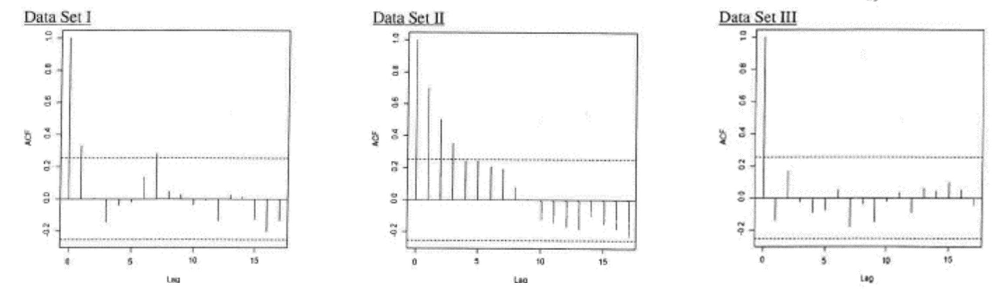

```{r setup, include=FALSE}
knitr::opts_chunk$set(echo = TRUE)

library(distributional)
```


Note: {Z~t~} ∼ WN(0,σ~Z~^2^ ) denotes white noise.\

##### Question 1 
Below, you are given the following graphs of autocorrelation functions for three separate data sets, each with n observations. The dotted lines in each graph correspond to 95% confidence intervals. Determine which of the above data sets exhibit statistically significant autocorrelations. Explain how you came to this conclusion.\

```{r echo=FALSE}

```

\setlength{\leftskip}{2cm}

  (A) I only;  
  (B) II only;  
  (C) III only;  
  (D) I, II and III;  
  (E) The answer is not given by (A), (B), (C), or (D).\

  The autocorrelation of the time series at each lag is only significant if the spike reaches past     the significance threshold level.  
  Dataset I is statistically significant at lag 3 and lag 7.  
  Dataset II is statistically significant up to lag 3.  
  Dataset III is not statistically significant at all.  
  Only Datasets I and Dataset II are statistically significant.  
  E.

\setlength{\leftskip}{0cm}
\

#### Question 2

For each of the two time series models, check stationarity and invertibility. Fully justify your answer.\

\setlength{\leftskip}{2cm}

  (a) X~t~ = Z~t~ − $\frac{2}{3}$Z~t−1~ − $\frac{1}{3}$Z~t−2~  

$$
\begin{aligned}
&X_{t}\ \text{is a moving average model, MA(2)}\\
& \text{By definition, moving average models are} \\
& \text{always stationary.}\\
X_{t} &= Z_{t}-\frac{2}{3}Z_{t-1}-\frac{1}{3}Z_{t-2}\\
& = \theta(B)Z_{t}\\
& = 1 -\theta_{1}B\ Z_{t-1} - \theta_{2}B^2\ Z_{t-2}\\
& = 1- \frac{2}{3}B\ Z_{t-1} - \frac{1}{3}B^2\ Z_{t-2}\\
&\theta(z) = 1 - \frac{2}{3}z-\frac{1}{3}z^2\\
z &= \frac{-(-2/3)\ \pm\ \sqrt{(-2/3)^2-4(-1/3)(1)}}{2(-1/3)}\\ \\
&= \frac{2/3\ \pm\ \sqrt{4/9+4/3}}{-2/3}\\\\
&= -1 \pm\ \frac{\sqrt{16/9}}{-2/3}\\\\
& = -1 + \frac{-4/3}{-2/3}\ or\ -1-\frac{4/3}{-2/3}\\
& = 1\ or\ -3\\ \\
&\text{This time series is not invertible.}
\end{aligned}
$$  

\setlength{\leftskip}{0cm}\

\setlength{\leftskip}{2cm}
  (b) X~t~ = (2/3) X~t−1~ + (1/3) X~t−2~ +Z~t~  
  
\setlength{\leftskip}{0cm}
  
  $$
  \begin{aligned}
  &X_{t} = Z_{t}+\frac{2}{3}X_{t-1}+\frac{1}{3}X_{t-2}\\
  &Z_{t} = X_{t}-\frac{2}{3}X_{t-1}-\frac{1}{3}X_{t-2}\\\\
  & \text{Since it is of the form},\ \phi(B)X_{t} = Z_{t},\\
  & \text{it is automatically invertible} \\\\
  &\phi(z) = 1 - \frac{2}{3}z-\frac{1}{3}z^2\\
  z &= \frac{-(-2/3)\ \pm\ \sqrt{(-2/3)^2-4(-1/3)(1)}}{2(-1/3)}\\ \\
  &= \frac{2/3\ \pm\ \sqrt{4/9+4/3}}{-2/3}\\\\
  &= -1 \pm\ \frac{\sqrt{16/9}}{-2/3}\\\\
  & = -1 + \frac{-4/3}{-2/3}\ or\ -1-\frac{4/3}{-2/3}\\
  & = 1\ or\ -3\\ \\
  &\text{This time series is not stationary}
  \end{aligned}
  $$

\setlength{\leftskip}{0cm}
\
\
  
#### Question 3 

\setlength{\leftskip}{2cm}

  (a) For a MA(3) process with coefficients θ~1~ = 2, θ~2~ = 0.5, and θ~3~ = −0.1\
    (i) Write the mathematical equation for MA(3) model with these coefficients\
      $$X_{t} = Z_{t}\ +\ 2\ Z_{t-1}\ +\ 0.5\ Z_{t-2}\ -\ 0.1\ Z_{t-3}$$  
    (ii) Calculate the autocorrelation function at lags 1, 2, 3, 4: ρ(1), ρ(2), ρ(3) and ρ(4)\
    $$\begin{aligned}
    \rho(k) &= \frac{\theta_{k}+\theta_{1}\theta_{k+1}+\theta_{2}\theta_{k+2}}{1+\theta_{1}^2+\theta_{2}^2+\theta_{3}^2}\\ \\
    
    \rho(1) &= \frac{\theta_{1}+\theta_{1}\theta_{2}+\theta_{2}\theta_{3}}{1+\theta_{1}^2+\theta_{2}^2+\theta_{3}^2}\\
    
    & = \frac{2+2(0.5)+0.5(-0.1)}{1+2^2+0.5^2+(-0.1)^2}\\
    & = 2.95/5.26\\
    &=0.5608 \\\\
    \rho(2) &= \frac{\theta_{2}+\theta_{1}\theta_{3}+\theta_{2}\theta_{4}}{1+\theta_{1}^2+\theta_{2}^2+\theta_{3}^2}\\ 
    &= (0.5+2(-0.1))/5.26\\ 
    & = 0.05703\\\\
    \rho(3) &= \frac{\theta_{3}+\theta_{1}\theta_{4}+\theta_{2}\theta_{5}}{1+\theta_{1}^2+\theta_{2}^2+\theta_{3}^2}\\ 
     &= -0.1/5.26\\
     &= -0.019\\\\
     \rho(4) &= \frac{\theta_{4}+\theta_{1}\theta_{5}+\theta_{2}\theta_{6}}{1+\theta_{1}^2+\theta_{2}^2+\theta_{3}^2}\\ 
     &=0\\
     &\rho_X(k)=0, \ k>q
    \end{aligned}$$
```{r}


Z_t <- rnorm(n=100, 0,1)
X_t <- Z_t + 2*Z_t + 0.5*Z_t - 0.1*Z_t
acf(X_t, lag=c(seq(1,4)), plot=FALSE)


```
  
  
    
  (b) For an AR(1) process with coefficient $\phi$~1~ = −0.5, 
    (i) Write the mathematical equation for AR(1) model with these coefficients\
    $$X_{t} = -0.5\ X_{t-1} + Z_{t}$$
    (ii) Calculate the autocorrelation function at lags 1, 2, 3, 4: ρ(1), ρ(2), ρ(3) and ρ(4)\
    $$
    \begin{aligned}
    & \rho_{X}(k) = \phi_{1}^k\\
    & \rho(1)= -0.5\\
    & \rho(2)= 0.25\\
    & \rho(1)= -0.125\\
    & \rho(1)= 0.0625\\
    \end{aligned}
    $$
\setlength{\leftskip}{0cm}
\
\

#### Question 4

You are given the following process: X~t~ = 3 + Y + Z~t~, where Y is a mean zero random variable with variance σ~Y~^2^ , independent of the white noise {Z~t~}. Determine whether the process X is stationary and find its autocovariance and autocorrelation functions.

\setlength{\leftskip}{2cm}


\setlength{\leftskip}{0cm}
\
\

#### Question 5

Let X~t~ = Z~t~ + 2Z~t−1~ − 8Z~t−2~.

\setlength{\leftskip}{2cm}

  (i) Identify the model as the model as MA(q) or AR(p), specify q or p respectively.
  (ii) Is the model stationary and invertible? Explain fully and show calculations where needed.
|    (Hint: review 4 from homework 1!)
  (iii) Find ρ~X~(2). Use R to simulate 300 values of {X~t~} and use your simulated values to plot sample acf. Compare your sample estimate of ρ~X~(2) to its true value found by calculations. Redo this part using 10,000 simulated values of X~t~.

\setlength{\leftskip}{2cm}


**The following problems are for students enrolled in PSTAT 274 ONLY**


G1Let{Zt}∼WN(0,1)and{Xt}begivenbyXt =Zt+θZt−2.
(a) Find the autocovariance and autocorrelation function for this process when θ = 0.8. (b) Compute the variance of the sample mean (X1 + X2 + X3 + X4)/4 when θ = 0.8. (c) Repeat (b) when θ = −0.8 and compare your answer with the result obtained in (b).
G2 Provide at least two examples of AR(2) models with autocovariance functions exhibiting very different behavior pattern. Include plots of corresponding theoretical acfs and the corresponding R code.
G3 Let Xt = Zt + θZt−1, t = 1,2,..., where Zt ∼ IID(0,σZ2 ). Show that Xt is both weakly and strictly stationary.
(Hint: for the last part express the joint moment generating function E exp(Pni=1 λiXi) in terms of function m(λ) = E exp(λZi).)
